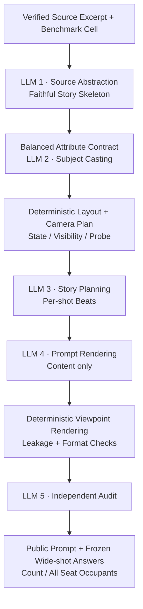

# WorldLine Prompt Constructor

> 仓库范围：代码、prompt 数据和文本构造记录已收录；历史视频评测与人工标注包保留在原本地工作区，文中相应路径不随仓库上传。

这是独立于网页测试环境的 Python Prompt 构造器。

当前默认评测为 **v5.1**：开场与最终帧统一忽略无关背景人物，同桌多出或重复的人仍计数。计数范围同时用于身份参照与位置标签，不新增字段；初始角色门槛、四项评分公式和公开 prompt 不变。此次仅更新规则及离线测试，没有付费重评；下述已完成 16 条仍为原 v5 结果，详见 [评测规范](REFERENCE_EVALUATION.md)。

**当前协议见 [初始场景 + Update + 最终全景](REFERENCE_EVALUATION.md)。** 默认构造入口 generate_core_v3.py 规划 outputs/v3.1，112 条 prompt 已于 2026-09-10 全部完成，本轮沿用 VAPI / `gemini-3.7-flash` 新增 96 条并保留原有 16 条，全量校验 0 错误；见 [prompt 总览](outputs/v3.1/prompts.md)、[公开 JSON](outputs/v3.1/public_prompts.json)和[构造完成记录](outputs/v3.1/CONSTRUCTION.md)。最终 Viewpoint 不含座位或地标约束，Update 按身份描述。v5 系列将开场空间参照、指定更新和最终两帧交给同一 Sol 主观察调用，再由代码推导目标并输出四项分数。Valid 只判断证据是否足够，不要求精确摄影或预设座位布局；明确的最终人数/位置错误进入评分。现已复用 16 条视频完成 v5 重评（本地历史产物，未随仓库上传；`evaluations/acceptance-v3.1-16-seedance-fast-v5/REEVALUATION.md`），Valid 10/16；旧 v4 结果保留不变。下文的固定座位答案、盲评和独立轨迹诊断描述保留为旧 v2/3.0 构造及 evaluation v2/v3 的复现说明，不是新协议。

**旧 3.0 设计记录见 [V3.md](V3.md)。** 已实现 112 配置的素材跨任务均衡、实际座位轮换、地标覆盖和三/四镜头混合计划；旧 outputs/v3 的 3.0 计划仍为 112 条待生成，不能作为已生成或已验证的正式数据。新入口 generate_core_v3.py 默认只规划，显式传入 --execute 才调用付费 LLM。下文原入口与分配规则描述的是可复现的 v2 路径；v2 产物及历史评测保留不变。

视频端到端测试与 LLM 裁判入口见 [Evaluation Suite](EVALUATION.md)。生成总时长按实际镜头数 × 3 秒计算，分辨率统一选择模型支持的最低档；当前 Seedance 2.0 Fast 三镜头 case 为 9 秒 / 480p。时长与分辨率均不写入公开 prompt；不同生成参数使用独立批次，不混合已有结果。

Evaluation 现统一采用 `openai/gpt-5.6-sol` 单裁判，不做第二模型复核或仲裁。最终全景固定帧盲评与独立事件诊断分开调用；所有评测输入均为图片。此改动不涉及下面 Prompt 构造器的 `prompt_audit` 阶段。

最终全景现在只取镜头内 25% 和 75% 的两张评分帧（evaluation v3）。`Valid` 表示两帧均满足视角、覆盖与可观察性要求，不代表人数/位置正确。已完成的五帧报告仍作为 v2 历史结果保留，两帧尚未付费重评。

```text
WorldBench_/
├── benchmark/             Python Prompt 构造器、评测框架与数据
└── docs/                  Benchmark proposal
```

Python 构造器不依赖 `sequence-lab-project`、Node.js、npm 或网页项目的 `.env.local`。当前实现只使用 Python 3.9 标准库。

## 当前范围

当前任务设计与构造能力包括：

- Static Viewpoint Change、Person Entry、Person Exit、Position Swap；
- 3 / 4 subjects；
- 主设计混合 3、4 shots，建立与重访之间可以包含一个或两个局部镜头；
- 现有 v2 已生成快照为 112 个三镜头案例，5、7 shots 作为显式扩展；
- 7 类 scene；
- Reverse Axis / Overhead 两种最终观察模式。

四种任务的初始状态、Shot 2 状态事件和最终 probe 均由 Python 确定性生成。现有 v2 快照包含 `7 × 2 × 2 × 4 = 112` 个唯一的三镜头案例。为保留该快照的可复现性，默认规划仍使用三镜头，主评测的三、四镜头混合清单应显式选择并另存。完整交叉两个镜头数会规划 224 个候选签名，这个规划数量不代表已经生成 224 条内容。5–8 subjects 仍需要新增对应 layout template，不能由 LLM 临时编造。

以下原始构造流程说明对应 v2，产物位于 `outputs/v2/`。原来的 `outputs/<case-id>/` 和旧 manifest 保留为历史结果，不会被 v2 自动复用。复现 v2 时应以 [v2 manifest](outputs/v2/core_matrix.manifest.json) 为准；当前 3.1 构造使用 [v3.1 manifest](outputs/v3.1/core_matrix.manifest.json)，不能递归读取 outputs 下所有历史 prompt。

所有 task 都只在最终全景评分，且统一包括 **主体数量正确** 与 **主体位置关系正确**。检查对象是全景内全部人物，不限于未被 Content 提及的 probe。开场全景提供参照；中间 partial 只形成局部观察和执行事件，不计入分数。

|Scene|空间锚点|
|---|---|
|Café|window / floor plant / counter|
|Meeting room|windows / presentation screen / glass door|
|Living room|sofa / armchairs / bookcase / doorway|
|Dining room|window / sideboard / patio doors|
|Seminar room|windows / pinboard / entrance|
|Game room|window / shelving unit / doorway|
|Kitchen|island / refrigerator wall / sink area|

每个 scene 都有 3 人与 4 人布局，并分别提供 reverse-axis 与 overhead probe 模板，共 28 个受控 layout。

## Pipeline



五个 LLM stage 分别进行一次独立的 structured-output 请求，使用显式配置的 VAPI 或 OpenRouter：

|Stage|输入|输出|
|---|---|---|
|`source_abstraction`|原文摘录、作品出处、scene|保留具体话题的 story skeleton + source ID|
|`subject_casting`|skeleton、均衡属性契约|gender + clothing color|
|`story_planning`|skeleton、casting、mention contracts|per-shot beats|
|`prompt_rendering`|approved beats、derived contracts|Content fields|
|`prompt_audit`|内部 episode、public prompt|pass / blocking issues|

正常路径是五次访问。某一阶段未通过本地验证时，只重新访问该阶段；最终审校失败时，只调用相应的 story 或 prompt repair。

Layout、人物座位、state、camera coverage、`expected_visible` 和 `probe` 全部由 Python 确定性计算，不调用 LLM。

3 人 baseline 的冻结轨迹为：

|Task|Shot 1|Shot 2 partial event|Final wide 中未写入 Content 的 probe|
|---|---|---|---|
|`static_viewpoint_change`|A/B/C 在场|无|C：应在场且保持原座位|
|`person_entry`|A/C 在场，B 缺席|B 进入 counter-side window seat|B：应在场；C：应在场且未变化|
|`person_exit`|A/B/C 在场|B 离开 counter-side window seat|B：应缺席；C：应在场且未变化|
|`position_swap`|A/B/C 在原座位|A/B 交换两个 window-side seats|B：交换后的座位；C：原座位；全景主评分还检查 A|

内部 `probe_expectations` 只记录每个 probe 的 `subject`、`present` 和必要时的 `seat`，用于区分“应重新出现”“应保持缺席”和“应出现在新位置”。

它是记忆诊断子集。实际评分答案在 `annotations.hidden.json`：`expected_count` 为受控互动区域人数，`expected_occupants` 为全部覆盖座位到主体 ID 的映射（空座为 null）。位置以地标座位为参照，不以画面左右为参照；数量正确但身份换错位置，位置分仍为失败。`worldline/annotations.py` 提供对已提取观察结果的两项评分及 joint success，不承担视频人物检测。

## Real Sources and Balanced Cast

[素材库](sources/catalog.json) 保存从六部真实出版作品采集的十四段原文，每个 scene 两段。每段都有作者、标题、原文 URL、章节、起始文字、摘录与 SHA-256。来源对应关系可由 `collect_sources.py` 的原文定位器复验；已有 catalog 不会被静默覆盖。

`source_abstraction` 实际读取原文，不把四种实验事件强行归为原作事实。`story_planning` 将真实互动改编到实验布局与 task，改编说明写入 `run.json.source.adaptation`。公开文字只保留简短话题和必要动作，不照搬台词、人物名或奇幻细节。选择其他已核验片段可用 `generate_prompt.py --source-id alice_riddle`；不再接受无出处的默认故事文本。

性别与颜色由 `worldline/balance.py` 分配，而不是由 LLM 根据叙事角色猜测。每个 task 的 A/B/C 均为 14 男、14 女；七种颜色各出现 4 次。同一 case 内颜色互异，衣服统一为 shirt；反打/俯拍配对沿用相同人物锚点。D 只存在于四人样本，每个 task 只有七个 scene 配对，因此性别为 6/8 或 8/6，整体为 28/28；各颜色每任务各出现 2 次。这些分布由集合验证器报告。

## Selective Viewpoint

公开 Prompt 不再为所有镜头提供完整摄影参数：

|Shot role|公开 Viewpoint|
|---|---|
|Opening wide|`Wide establishing shot` + 观察侧 + 观察方向 + 全部初始座位覆盖|
|Intermediate partial|`Medium two-shot` / `Close-up` + 观察侧 + focal seats|
|Final wide probe|`Reverse wide shot` + 观察侧 + 观察方向 + 重新覆盖的座位|

例如中间镜头只写：

```text
Medium two-shot from the aisle side, centered on the two adjacent window-side seats.
```

它负责形成局部观察，并可承载 entry、exit 或 position swap 等状态更新；partial shot 本身不作为 probe。焦距、相机高度、光轴、精确裁切边界等参数不会进入公开 Prompt。

Opening wide 与后续 wide probe 必须形成强视角变化：默认沿两个地标之间的轴线反向观察，例如 `counter_to_plant → plant_to_counter`；也允许由平视切换到 overhead。仅移动机位但继续朝同一地标拍摄不合格。

公开 Viewpoint 使用跨模型通用的自然语言摄影词汇，并固定采用 `shot scale → camera origin → viewing direction/target → spatial coverage` 的顺序。使用正向、直接的构图描述，不写 `do not show`、`without` 或 `framing only`，也不使用角度数值、焦距或精确运动轨迹。每个 `Content` 和 `Viewpoint` 字段必须各自保持单行。

Intermediate framing 不能完全省略；否则模型可能继续生成全景，benchmark 就无法确认 offscreen 条件是否形成。实际生成是否符合该 framing 由后续 View Compliance 判断。

Content 不采用句数或固定词数上限，而采用“最小事实”原则。每个布局模板提供一段固定、简洁但具备空间信息的 `public_intro`，依次说明场所、核心交互区域位于何处，以及支撑座位和机位描述的 1–2 个地标；第一镜必须先使用这段场景建立，再引入人物，不允许 LLM 自由扩写氛围或装饰。人物只通过 gender + clothing color 区分，例如 `a woman in a mustard-yellow sweater`，同一人物的身份锚点在单个镜头内只出现一次。随后把身份、短座位标签和必要动作合并表达；静态任务只让一名人物发起故事，其余人物仅建立身份与座位，不重复听众名单，也不为每个人强行安排动作。除此之外，不添加姿态、目光、表情、手势、道具操作或修饰性副词；发型、发色、眼镜、配饰、年龄和稳定面部特征同样不进入公开 Prompt。

## Files

```text
benchmark/
├── generate_prompt.py       命令入口
├── generate_matrix.py       Core matrix 规划与可恢复批量生成
├── collect_sources.py       真实原文采集与定位
├── validate_matrix.py       产物集合级离线验证
├── sources/catalog.json     原文摘录与出处
├── worldline/
│   ├── layouts.py           受控布局与相机模板
│   ├── matrix.py            112-case 基础矩阵与长序列扩展
│   ├── artifacts.py         产物写入、复用与去重
│   ├── sources.py           来源选择和摘录校验
│   ├── balance.py           角色与性别、颜色解耦
│   ├── annotations.py       冻结答案、全景数量与位置评分
│   ├── openrouter.py        独立 structured-output 客户端（VAPI / OpenRouter）
│   └── pipeline.py          五阶段构造与验证逻辑
├── tests/test_pipeline.py   离线测试
└── outputs/v2/              v2 历史快照；当前构造在 outputs/v3.1/
```

## Configure

```bash
cd benchmark  # 从仓库根目录运行；已经在 benchmark 内时无需重复执行
cp .env.example .env
```

新配置使用 `PROMPT_PROVIDER=vapi`，在 `.env` 中填写独立的 `VAPI_API_KEY`；已有 `.env` 不要覆盖。`VAPI_BASE_URL=https://api.gpt.ge/v1`，前四个构造阶段使用 `VAPI_PROMPT_MODEL=gpt-5.6-sol`，审校使用 `VAPI_AUDIT_MODEL=gpt-5.6-luna`。可选阶段覆盖为 `VAPI_SKELETON_MODEL`、`VAPI_CAST_MODEL`、`VAPI_STORY_MODEL`、`VAPI_RENDER_MODEL`。五阶段仍是独立请求，schema、故事规则和公开 prompt 格式不变。

当前本地 `.env` 已将 `VAPI_PROMPT_MODEL` 和 `VAPI_AUDIT_MODEL` 都设为 `gemini-3.7-flash`；2026-09-10 的剩余 v3.1 构造沿用该配置，五阶段保持独立调用。上面的 Sol/Luna 是 `.env.example` 中的默认值及早期连接测试配置，实际产物模型以 `run.json` 为准。

VAPI 使用 `/chat/completions`、Bearer 认证与 `max_completion_tokens`，不发送 OpenRouter 专有的 `provider` 参数或归属头。请求保留原有阶段 temperature；没有加入新的 reasoning 设置，采用服务默认。接入依据：[VAPI 兼容性说明](https://gpt.ge/en/doc/api-compatibility-openai-claude-gemini)、[GPT‑5.6 Sol 官方说明](https://developers.openai.com/api/docs/models/gpt-5.6-sol)。

`python3 check_prompt_api.py --execute --output-dir experiments/your-unique-connection-test` 对构造和审校模型各做一次很小的付费 JSON-schema 测试，结果写入指定的新目录；不生成 benchmark case、视频或评测。检查模型列表成功不等于实际模型调用成功，需查看该测试的 `status`。

VAPI 默认等待时间为 `VAPI_TIMEOUT_SECONDS=240` 秒；不改变旧 OpenRouter 的 120 秒等待时间。2026-09-10 首次测试超时，保留在 `experiments/vapi-gpt56-connection-20260910/`；延长等待的测试在 `experiments/vapi-gpt56-connection-20260910-retry1/result.json` 中记录 Sol 和 Luna 均通过，返回模型分别为 `gpt-5.6-sol` 与 `gpt-5.6-luna-2026-07-09`。该记录验证连接和小型结构化输出，不能代替完整 case 的生成与质量审查记录。用量记录不包含计费金额，不能据此断言首次超时未扣费。

未配置 `PROMPT_PROVIDER` 的旧环境仍使用 OpenRouter；其 key 和 `OPENROUTER_*_MODEL` 不会被 VAPI 路径读取。没有跨服务或跨模型自动回退。`run.json`/逐阶段 trace 保存实际服务、请求模型、返回模型、用量与端点，不保存 key。此次迁移不修改视频生成和 evaluation 的 OpenRouter 接口，也不重写历史样本。批量构造收到 401/402/403 后停止启动新 case；已在途请求可能完成，待处理 case 保持 pending，旧失败日志保留。

故事 schema 按当前 case 的已知任务选择单一事件结构：entry/exit 保持 `subject + action`，swap 保持 `subject + action + with_subject`；静态任务的事件数组必须为空。全部声明字段仍为 required，禁止额外属性。2026-09-10 实际批量调用发现部分 VAPI Gemini 路由无法转换 `anyOf` 内的 `additionalProperties`，因此去掉了不必要的联合分支；实验事件、公开 prompt 与隐藏答案规则不变。本地仍验证逐镜头事件与确定性契约完全一致。Gemini 的结构化输出仅支持 JSON Schema 子集，仍需应用侧语义验证，参见 [官方说明](https://ai.google.dev/gemini-api/docs/structured-output)。

读超时和服务端断连会按既有退避间隔重试，单阶段最多 4 次请求；失败日志与已成功阶段仍保留。

v3.1 现对多名同性人物出现后、使用未限定 he/she 开始新发言分句的情况增加本地消歧检查，并同步构造与审校指令。9 条已发现问题的样本已按原故事规划完成最小修订及真实重审；旧 16 条和全部隐藏状态不变，见[指代修订记录](outputs/v3.1/revisions/pronoun-20260910/REPORT.md)。

批次断点继续可用 `python3 generate_core_v3.py --version 3.1 --output-root outputs/v3.1 --execute --resume --workers 4`。只有模型、服务、端点、system、输入、schema 和 temperature 完全一致的已成功阶段前缀才复用；所有本地质量检查仍执行。旧日志保留，新日志标记复用记录，不为相同已成功阶段再次付费。整批通过后，`python3 export_prompts.py --output-root outputs/v3.1` 导出 `prompts.md` 总览和 `public_prompts.json`，不含隐藏答案。

网页项目仍使用自己的：

```text
sequence-lab-project/.env.local
```

两者互不读取。

## Generate

```bash
cd benchmark  # 从仓库根目录运行；已经在 benchmark 内时无需重复执行
python3 generate_prompt.py
```

选择任务类型：

```bash
python3 generate_prompt.py --id WL-ENTRY-001 --task person_entry
python3 generate_prompt.py --id WL-EXIT-001 --task person_exit
python3 generate_prompt.py --id WL-SWAP-001 --task position_swap
```

生成更长的同布局序列：

```bash
python3 generate_prompt.py --id WL-PY-7SH-001 --shots 7
```

复现现有三镜头快照的矩阵规划，不访问 OpenRouter：

```bash
python3 generate_matrix.py
```

输出 `outputs/v2/core_matrix.manifest.json`。显式执行当前 112-case 基础矩阵：

```bash
python3 generate_matrix.py --execute
```

规划同时包含三、四镜头的候选集合，并将新清单与既有快照分开保存：

```bash
python3 generate_matrix.py --shots 3 4 \
  --manifest outputs/planned_mixed_shots.manifest.json
```

该命令只规划，不调用生成服务。新增四镜头内容尚未批量生成，完成数量以实际产物及通过校验的清单为准。5、7 镜头仍需显式选择。

批量生成默认顺序执行，可通过 `--workers 4` 并行构造四条互不依赖的 case。每完成一条就更新 manifest。重新运行会复用当前版本的合格产物，只补未完成或不合格的样本；历史版本不会被误当作新结果。失败调用的阶段产物保留在对应 case 的 `attempt-*.json`。建议先使用筛选与 limit 做小批验证：

```bash
python3 generate_matrix.py \
  --scene "meeting room" \
  --task person_entry \
  --subjects 4 \
  --shots 3 \
  --viewpoint overhead \
  --execute --limit 1
```

前四个生成阶段默认使用 `OPENROUTER_PROMPT_MODEL`。也可以分别设置：

```text
OPENROUTER_SKELETON_MODEL
OPENROUTER_CAST_MODEL
OPENROUTER_STORY_MODEL
OPENROUTER_RENDER_MODEL
OPENROUTER_AUDIT_MODEL
```

或通过 `--skeleton-model`、`--casting-model`、`--story-model`、`--render-model` 和 `--audit-model` 覆盖。

## Outputs

每次运行写入：

```text
outputs/v2/<episode-id>/
├── prompt.txt
├── prompt.public.json
├── episode.internal.json
├── annotations.hidden.json
├── run.json
└── attempt-001.json
```

完整矩阵另有：

```text
outputs/v2/core_matrix.manifest.json
```

`run.json` 保存每个 LLM stage 的最终结构化产物、真实来源、模型配置及每次访问的输入/输出，不保存 API Key。`annotations.hidden.json` 保存布局快照和校验和、身份参照镜头及全景答案；partial 不含评分记录，开场记录 `scored=false`。

当前 manifest 的自动检查状态与人工/视频验证状态分开。通过文本和结构检查不意味着实际视频一定遵循机位；人工复核、视频 pilot 和自动视觉评测属于后续验证，不能由 LLM audit 的通过状态代替。

`prompt.public.json` 保留每个 Shot 独立的 `content` 与 `viewpoint`。面向商业模型的 `prompt.txt` 使用一行一个 Shot 的通用格式，并将 Viewpoint 放在 Content 之前：

```text
Shot 1: [Viewpoint] [Content]
Shot 2: [Viewpoint] [Content]
Shot 3: [Viewpoint] [Content]
```

文本中不写时间段或每镜时长；原生 Custom Multi-Shot 接口可以由模型适配器把每一行映射到独立 Shot 槽位。

## Case Identity

一个测试案例由以下五个实验维度共同定义：

```text
task type × scene/layout × viewpoint mode × subject count × shot count
```

两条正式 case 至少必须有一个维度不同。人物服装颜色、故事措辞或随机种子变化不构成新 case，只能作为同一 case 的 robustness variant。生成命令默认拒绝与已有新格式产物完全相同的 case signature；只有显式使用 `--allow-duplicate-signature` 才允许生成重复 signature。

公开 Prompt 不包含每镜时长、总时长、时间戳、帧率、分辨率、生成参数或 hidden probe 答案。

## Test

测试完全离线，不访问 OpenRouter：

```bash
cd benchmark  # 从仓库根目录运行；已经在 benchmark 内时无需重复执行
python3 -m unittest discover -s tests -v
```

生成完成后，可对 manifest、全部中间产物、公开 Prompt、唯一签名和维度分布进行集合级复验，同样不访问 OpenRouter：

```bash
python3 validate_matrix.py
```

保存包含来源覆盖、性别与颜色分布的完整检查报告：

```bash
python3 validate_matrix.py --report outputs/v2/validation.report.json
```
