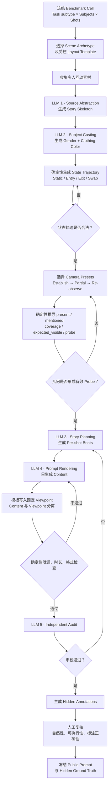

# Probing World-State Maintenance through Controlled Viewpoint Changes in Multi-Shot Video Generation

当前工程协议：构造版本 3.1，评测版本 v4；详见 [初始场景 + 指定 Update + 最终全景](../benchmark/REFERENCE_EVALUATION.md)。位置目标以满足基本条件的实际开场为参照，由要求的事件推导。最终生成 prompt 不再加入座位或地标提示。旧 v2 样本、3.0 计划及已开始的旧协议人工标注均保留为历史材料，新版 112 配置仍待生成，尚无新版实测结果。

## 1. Research Goal

现有多镜头视频生成评测大多关注人物外观是否一致，例如同一角色在不同镜头中是否保持相似的脸、服装和整体 appearance。但这种一致性并不能回答一个更基础的问题：

> **当摄像机不断改变观察对象、镜头尺度和观察方向时，模型是否仍然维护着此前故事已经建立的世界状态？**

一个连贯的多镜头视频不应被理解为若干独立二维画面的组合，而应被理解为对同一个持续演化世界的多次局部观察。人物暂时离开当前画面，并不意味着其从故事世界中消失；只有当故事明确发生 entry、exit 或位置变化时，对应状态才应该更新。

因此，我们不试图证明模型内部真正具有某种 world model，而是测试：

> **模型生成行为是否符合持续维护和选择性更新世界状态的假设。**

形式上，每个 shot prompt 被拆分为：

\[ p_t=(c_t,v_t), \]

其中 \(c_t\) 表示 **Content**，描述当前故事发生了什么；\(v_t\) 表示 **Viewpoint**，描述摄像机如何观察这个世界。

对应地：

\[ S_t=\mathrm{Update}(S_{t-1},c_t), \]\[ O_t=\mathrm{Observe}(S_t,v_t). \]

核心问题因此变成：当 \(v_t\) 不断变化时，模型能否保持 \(S_t\) 中没有被修改的内容，并只根据 \(c_t\) 更新真正发生变化的部分。

---

## 2. Benchmark Scope

WorldLine 在概念上是一个 **world-state-centric benchmark**，但为了保证自动评测的可靠性和可行性，第一版主要以**人物作为 world state 的 observable probe**。

也就是说，故事世界可以包含人物、位置、关系、动作、物体和事件，但核心自动评测首先关注：

\[ \text{Who is in the scene?} \]\[ \text{Who has entered or left?} \]\[ \text{Where are the subjects relative to one another?} \]\[ \text{Is a re-observed subject still the same subject?} \]

因此，主体不是研究终点，而是我们用来判断模型是否维护 underlying world state 的主要抓手。

背景、物体状态和更复杂的空间结构可以作为未来扩展，而不需要第一版 benchmark 全部覆盖。

Prompt 构造与视频生成、评测保持独立入口。现已实现构造及单裁判评测代码，历史 pilot 已执行；新协议仍需实际构造、视频验证与人工校准，不能把旧协议结果作为新版正式分数。

---

## 3. Core Benchmark Design

整个 benchmark 由三个维度组织：

\[ \boxed{ \text{Task Type} \times \text{Subject Count} \times \text{Shot Count} } \]

其中 **Viewpoint Change 不作为额外难度维度**，而是所有测试样本必须满足的基本实验条件。

在数据实例层面，还需要区分 scene/layout 与 viewpoint mode。因此，一条正式 case 的唯一性签名定义为：

\[ \boxed{\text{task type}\times\text{scene/layout}\times\text{viewpoint mode}\times\text{subject count}\times\text{shot count}} \]

任意两条正式 case 至少必须在其中一个维度上不同。只改变人物服装颜色、故事措辞或随机种子，不构成新的测试案例；这些输出只能作为同一 case 的 robustness variants。

### Task Type

任务在概念上分为 **Persistence** 和 **State Update** 两类，在数据构造时落实为四个可操作的 subtype：

|Task family|Operational subtype|显式状态变化|最终观察目标|
|---|---|---|---|
|Persistence|Static Viewpoint Change|无|切换视角后，未离场人物仍存在于正确位置|
|State Update|Entry|人物进入|新人物出现，同时原有人物仍被保留|
|State Update|Exit|人物离开|离场人物消失，同时未离场人物仍被保留|
|State Update|Position Swap|两人交换位置|身份与位置关系同时正确更新，其他人物不变|

**Static Viewpoint Change** 测试场景状态不变、只改变观察方式时，人物是否能够经历局部观察后继续存在：

\[ \mathrm{Present} \rightarrow \mathrm{Offscreen} \rightarrow \mathrm{Present}. \]

例如三个人围桌交谈，第一镜建立三人的身份和座位，中间镜头只观察其中两人，最后一个全景重新覆盖整张桌子。没有离开的第三人应该再次出现，即使最终 Content 没有再次提醒其存在。

**Entry** 测试一个最初不在场的人物通过明确事件进入场景：

\[ \mathrm{Absent} \rightarrow \mathrm{Entry} \rightarrow \mathrm{Present}. \]

最终全景既要观察到新进入的人物，也要确认原有主体没有因注意力转移而消失。

**Exit** 测试一个已建立人物明确离开场景：

\[ \mathrm{Present} \rightarrow \mathrm{Exit} \rightarrow \mathrm{Absent}. \]

例如四个人 A、B、C、D 中，C 明确离开，那么最终模型应该同时做到：

\[ C=\mathrm{Absent}, \qquad D=\mathrm{Present}. \]

**Position Swap** 测试两个已建立人物明确交换位置：

\[ (A@x,B@y)\rightarrow\mathrm{Swap}\rightarrow(A@y,B@x). \]

它不能只检查“画面里还有两个人”，而要检查人物身份与空间位置是否一起更新。

三个动态 subtype 共同测试：

\[ \boxed{ \text{Update what changed} + \text{Preserve what did not change} } \]

---

## 4. Difficulty Design

难度不采用模糊的 Easy / Medium / Hard，而通过两个明确变量控制。

### Subject Count

第一版 Core Track 使用：

\[ N_s\in\{3,4\}. \]

3 人是最小有效多人设置。局部镜头关注 1–2 人时，至少还存在一个真正的 non-focal subject。

4 人显著增加需要同时维护的人物及其空间关系，例如方桌两侧各坐两个人，两两面对面。

Core Track 稳定后，Hard Subject Track 可以逐步扩展到：

\[ N_s\in\{5,6,7,8\}. \]

5–8 人样本不能简单通过在 Prompt 中增加人物描述得到。每一种人数和空间结构都必须有经过验证的 layout template、座位分配和 camera coverage；否则无法区分“人物丢失”和“相机本来就拍不到”。

因此可以独立分析：

\[ \text{Performance vs. Subject Count}. \]

### Shot Count

基础设计使用不同镜头数量来增加观察历史的多样性：

\[ N_t\in\{3,4\}. \]

建立场景、局部观察和重访场景是三个功能阶段，不要求每个阶段恰好对应一个镜头。第一镜建立人物与座位，最后一镜提供全景读出，中间阶段可以包含一个或两个局部镜头。

三镜头实例为：

\[ W_A \rightarrow Partial_1 \rightarrow W_B. \]

四镜头实例为：

\[ W_A \rightarrow Partial_1 \rightarrow Partial_2 \rightarrow W_B. \]

状态事件在第一个局部镜头中发生，新增的局部镜头通过不同的观察范围或焦点承接事件后的故事，不重复执行事件，不补写全体未变化人物，也不改变最后的评分目标。镜头数与生成时长分别记录，对长度的对照分析需要匹配事件和最终状态。

现有 v2 构造快照已经生成 112 个三镜头 prompt。它是已完成产物的记录，不是将整个 benchmark 限制为三镜头的定义。主评测采用三、四镜头混合清单，新增案例必须完成内容生成、自动校验和人工复核后，才能与既有案例一起冻结并用于实验。镜头数分布应与任务、场景、主体数量和最终视角一起报告。

5-shot 和 7-shot 可以作为更长观察历史的扩展。公开 Prompt 不包含每镜时长、总时长、时间戳、帧率或分辨率，这些仍属于执行配置。

|Task subtype|Subjects|Shots|核心问题|
|---|---|---|---|
|Static Viewpoint Change|3 或 4|3 或 4|跨不同长度观察历史的状态保持|
|Entry|3 或 4|3 或 4|加入新主体并保留原主体|
|Exit|3 或 4|3 或 4|移除变化主体并保留未变化主体|
|Position Swap|3 或 4|3 或 4|选择性更新人物位置|
|Long-Horizon extension|3 或 4|5 或 7|跨更多次局部观察的扩展|
|Hard Subject extension|5 至 8|单独冻结|需要新增并验证相应布局|

---

## 5. Controlled Observation Design

Camera design 是整个 benchmark 最重要的控制机制，但内部 camera plan 与公开 Viewpoint 不需要具有相同详细度。内部模板精确记录人物布局和 camera coverage；公开 Prompt 只暴露形成实验条件所需的最少观察信息。

### World State、Prompt Mention 与 Camera Coverage

对每个 shot，构造管线必须严格区分：

```text
present           当前世界状态中仍在场的人物
mentioned         当前 Content 明确提及的人物
camera_coverage   由相机几何覆盖的座位或区域
expected_visible  present ∩ camera_coverage
probe             expected_visible - mentioned
```

核心 probe 不是要求 Prompt 写出所有应出现的人物，而是有意让以下三件事同时成立：

1. 某人物仍存在于故事世界；
2. 当前 Content 不再提及该人物；
3. 当前相机几何仍覆盖该人物所在位置。

如果模型维护了此前建立的 world state，该人物应该自然出现在生成画面中。

对于 Exit case，最终镜头还需要覆盖离场人物原先所在的区域，并检查该人物没有错误重现。对于 Position Swap case，则检查相机覆盖位置上的 expected occupant，而不是只检查人物总数。

`probe` 是未提及主体的诊断子集，不是主评分的全部对象。四种任务一律在最终全景检查所有人物的数量与位置关系，包括当镜 Content 提及的人物。开场全景作为初始参照；partial 仅形成观察条件和执行事件，不计入这两个分数。

### Camera Grammar

所有 episode 的第一个镜头必须是 **establishing wide shot**，用于建立：

\[ S_0= \{ \text{subjects}, \text{appearance}, \text{positions}, \text{relations}, \text{scene context} \}. \]

之后可以使用：

\[ \mathrm{CloseUp}, \mathrm{Medium}, \mathrm{TwoShot}, \mathrm{MediumWide}, \mathrm{Wide}. \]

这些镜头形成对同一世界的 partial observations。后续必须至少包含一次可评测的 wide re-observation。

Re-observation 不能简单复制第一镜的二维构图，也不能只是移动机位后继续朝同一地标拍摄。它需要从另一个经过定义的机位重新覆盖足够多的原场景，使人物存在、缺失和位置关系可以被判断。当前 Core 同时包括轴线反打（如 `counter_to_plant → plant_to_counter`）与 overhead，两种模式各 56 条。

不同镜头采用不同强度的 Viewpoint：

- **Establishing wide:** 使用 `Wide establishing shot`，简洁说明观察侧、观察方向和全部初始座位覆盖；
- **Intermediate partial:** 使用 `Medium two-shot` 或 `Close-up` 等通用词汇，例如 `Medium two-shot from the aisle side, centered on the two adjacent window-side seats.`；它可以承载状态更新，但不作为 probe；
- **Final re-observation:** 只使用 `Reverse wide shot` 或 `Top-down wide shot` 加互动区域名称，不列出座位、目标人数、人物位置或需要入镜的地标。自然背景可辅助评测，但不作为公开的硬性地标约束。

公开 Viewpoint 的统一语法是 `shot scale → camera origin → viewing direction/target → spatial coverage`。它采用正向、直接且可独立执行的自然语言，不写排除式要求，不使用角度数值、焦距或精确运动轨迹。每个 Content 和 Viewpoint 字段各占一行，不在句子中间换行。

只有非开场的 wide re-observation 参与 world-state 评分。Intermediate partial shot 负责形成局部观察以及执行 entry、exit 或 position swap；其生成结果只做 View Compliance 和事件可见性检查，不直接计算 world-state probe 分数。

中间镜头不能完全删除 framing。否则模型可能继续生成三人全景，预期的 $\mathrm{Present}\rightarrow\mathrm{Offscreen}\rightarrow\mathrm{Present}$ 条件并未实际形成。但它不需要焦距、相机高度、光轴、肩部裁切或详细 frame boundary。

不要使用只有相对含义、无法直接执行的表达，例如：

> from a different direction than the opening view

公开的 partial framing 只负责引导观察焦点；其实际结果由 View Compliance 检查。只有生成结果确实形成局部观察时，该 episode 才具有预期的 offscreen 条件。

相机几何、座位分配和公开 Viewpoint 文本均由受控模板提供，不能交给 LLM 自由改写。LLM 负责故事抽象、人物的 gender + clothing color 锚点和 Content 表达。

---

## 6. Benchmark Construction Pipeline

### Scene and Story Construction

首先建立有限数量的 scene archetypes。第一版使用 6–8 类空间稳定、适合多人互动的场景即可，例如聚餐、会议、客厅聊天、咖啡馆、小组讨论、桌游和厨房协作。

随后从真实电影情节、短剧、剧本和网络故事中寻找自然的多人互动作为创作依据。目的不是复制原故事，而是抽象出自然的 story skeleton，减少完全依赖 LLM 创作造成的模板化和重复性。

当前 v2 已落实为 `benchmark/sources/catalog.json`：从 Project Gutenberg 的六部真实出版作品中采集十四段原文，每个 scene 对应两个素材片段。作品为《爱丽丝漫游奇境》《三人同舟》《认真的重要性》《傲慢与偏见》《福尔摩斯冒险史》《小妇人》。每段记录作品、作者、原文 URL、章节与起始文字、摘录、摘录 SHA-256；原文实际传入 `source_abstraction`，不是事后附加引用。相机模式不影响素材选择。

Source Abstraction 忠实提取原文中的话题、问答或分歧，不强行声称原作发生了目标状态事件。Story Planning 再把该互动改编到固定场景、人数和 task；人物进入、离开、交换位置若不在原文中，明确属于实验改编。审校同时检查来源对应关系与改编后的实验契约。公开 prompt 不引用原文台词、不使用原作人物名称。

人物属性由矩阵均衡契约约束，LLM 独立返回并验证该契约，不能依照原作角色或 A/B/C/D 推断性别与衣服。当前统一采用七种常见颜色的 shirt；同一 case 内颜色不同。同一任务的 A/B/C 各为 14 男、14 女，各颜色各出现 4 次；仅存在于四人 case 的 D 在每个任务下为 6/8 或 8/6，在整个矩阵为 28/28，各颜色每任务各出现 2 次。相同 scene/task/count 的反打和俯拍使用同一人物属性。配对规则不要求生成的故事措辞完全相同，不把两种视角结果宣称为严格单变量因果比较。

Story skeleton 只保留原文中的人物角色、具体互动话题、关键事件与叙事顺序。与目标 task 不同的 entry、exit 或 position swap，在后续 Story Planning 中按实验契约删除或加入，并标为改编。

确认人物数量后，为每个人物分配简单且可辨识的 identity anchor。第一版统一使用 **gender + clothing color**，例如 `a woman in a mustard-yellow sweater`。公开 Content 采用“最小事实”原则。每个布局模板首先提供一段固定、简洁但具备空间信息的场景引入，依次说明场所、核心交互区域位于何处，以及支撑座位和机位描述的 1–2 个地标；第一镜必须先完成场景建立，再引入人物，不允许 LLM 自由扩写氛围或装饰。随后只保留人物锚点、短座位标签和推动故事所必需的动作；同一身份锚点在一个镜头内只出现一次。静态任务的第一镜只让一名人物发起故事，其余人物仅建立身份与座位，不重复听众名单，也不为每个人强行安排动作。同时不添加姿态、目光、表情、手势、道具操作或修饰性副词。发型、发色、眼镜、配饰、年龄和稳定面部特征也不作为区分字段，避免无关视觉细节干扰 world-state probe。

### Layout before Language

Prompt 构造必须先确定人物布局和相机位置，再生成自然语言：

\[ \boxed{\text{Layout}\rightarrow\text{World-State Trajectory}\rightarrow\text{Camera Plan}\rightarrow\text{Prompt}} \]

LLM 不负责决定桌子形状、人物座位、camera coverage、评分答案或属性分布。它接收已经冻结的实验约束，生成 source-grounded story skeleton、符合均衡契约的 gender + clothing color、自然的 story beats 和每个 shot 的 Content，并进行独立审校。

当前实现位于独立的 `benchmark/` Python 工程中，与 `sequence-lab-project/` 网页测试环境分离。它通过 OpenRouter 完成五个相互独立的 structured-output 访问。每次访问只负责一个阶段，后一个阶段只接收前面已经通过验证的结构化产物：

1. `source_abstraction`：有出处的原文摘录 → 忠实 story skeleton；
2. `subject_casting`：skeleton + 均衡属性契约 → gender + clothing color；
3. `story_planning`：skeleton + casting + mention contracts → per-shot beats；
4. `prompt_rendering`：approved beats → public Content；
5. `prompt_audit`：完整 episode + public prompt → pass / blocking issues。

Layout、state transition、camera plan、visibility 和 probe 推导属于确定性控制步骤，不调用 LLM。

当前 Core 构造器已经实现 7 类 scene：café、meeting room、living room、dining room、seminar room、game room 和 kitchen。每个 scene 都提供 3/4 人布局以及 reverse-axis/overhead 两种最终观察模板，共 28 个 layout。现有 v2 快照组合 4 个 task subtype 与 3 shots，包含 112 个签名唯一的 case。当前主设计采用 3、4 镜头混合，批量入口可以显式传入 `--shots 3 4`，底层语法在中间阶段插入相应数量的局部镜头。默认参数仍用于复现既有 v2 快照，新主评测清单应另存并冻结，避免覆盖历史记录。5、7 镜头保留为显式扩展。`generate_matrix.py` 默认只生成离线 manifest；只有显式使用 `--execute` 才访问 OpenRouter，并在每条完成后保存状态以支持中断续跑。

### End-to-End Flow



本阶段管线到 S 为止，不负责调用视频模型或执行最终 benchmark evaluation。

### Minimal Internal Record

为了保证可维护性，内部数据只保留生成和评测真正需要的字段：

```text
episode: id, task_subtype, subject_count, shot_count, scene, layout_id
subjects: id, gender, clothing, initial_position
shots: index, event, camera_id, mentioned
derived: present, expected_visible, probe, expected_positions
public: content, viewpoint
```

其中 `present`、`expected_visible` 和 `probe` 应由 state trajectory 与 camera template 自动推导，不要求人工重复填写。

在 3.1 baseline 中，动态事件发生于第一个 partial shot。Entry 在开场建立唯一空位，随后让 B 进入并坐到空位；Exit 让 B 离开其位置并退出场景；Position Swap 让 A/B 交换各自原来的位置。事件按人物身份描述，不重复地标座位标签。最终 Content 不重述位置或未提及人物的存在；最终全景仍检查所有人，包括没有发生更新的旁观者。

内部只增加一个直接服务于评分的派生字段：

```text
probe_expectations: [{subject, present, seat}]
```

当 `present=false` 时，`seat` 为 null；它不再进入 `expected_visible`，但仍然是 final wide 中需要检查的负向 probe。该字段完全由确定性状态轨迹推导，不由 LLM 填写。

v2 将答案写入独立 `annotations.hidden.json`，不只依赖未来重跑代码。每个全景记录 `shot`、`scored`、`expected_count`、`expected_occupants`（地标座位 → 主体 ID 或 null）与 `unmentioned_probes`；同时保存布局快照、SHA-256 和人物首次建立的参照镜头。开场 `scored=false`，partial 不生成评分记录。Entry 的新人物首次出现在 Shot 2，可作为身份参照，但 Shot 2 不参与评分。

每次独立 LLM 访问的输入、输出、模型与参数记录于 `run.json`，失败尝试也保留在 `attempt-*.json`。当前版本位于 `benchmark/outputs/v2/`；旧产物保留在原目录，不混入 v2 manifest。自动检查通过不等于人工复核或视频验证通过；manifest 如实记录审核阶段。

---

## 7. Prompt Format and Leakage Control

内部数据始终保留 Content 与 Viewpoint 的独立结构：

> **Shot t**\
> **Content:** ...\
> **Viewpoint:** ...

Content 与 Viewpoint 必须职责分离。

面向商业模型的公开文本则统一序列化为每个 Shot 一行，并把摄影约束放在故事内容之前：

```text
Shot 1: [Viewpoint] [Content]
Shot 2: [Viewpoint] [Content]
Shot 3: [Viewpoint] [Content]
```

该格式可以直接作为单 Prompt 多镜头模型的输入；对于 Kling Custom Multi-Shot 等原生分镜接口，模型适配器将每一行映射为一个独立 Shot 槽位。公开文本不包含时间段或每镜时长。

**Content 决定故事世界发生什么变化；Viewpoint 决定摄像机如何观察这个世界。**

第一个 shot 的 Content 负责建立人物的 gender、clothing color 和座位，但不需要重复 Viewpoint 已经表达的完整背景几何。这里不设置句数或固定词数限制，只要求自然、必要且无重复。

但从第二个镜头开始，Content **只描述当前故事焦点，不机械重复已经建立但没有变化的事实**。

例如不要写：

> The other three people remain at the table.

因为这正是我们希望模型自己维护的信息。

如果要在建立镜头中表达“服务员完成上菜后没有离开”，可以写：

> A waitress in a green uniform sets the dishes on the table, then comes to a stop beside it.

这句话只在状态建立时确定她最终站在桌旁。后续 Content 不再重复 “she remains there” 或 “she does not leave”；是否继续存在由 world-state trajectory 与后续 camera coverage 决定。

对于 Entry、Exit 和 Position Swap，变化发生的镜头必须明确描述事件；最终 re-observation 不得再次复述 ground truth。例如 Exit case 的最终 Content 不能写：

> C has left, while A, B and D remain seated.

否则 benchmark 就把答案重新输入给模型了。

Intermediate Viewpoint 只写极简 focal framing；opening 可建立观察侧和布局，final 仅使用标准反打或直接俯拍全景，不写座位清单、地标必须入镜或答案提示。所有 Viewpoint 都不写 benchmark 意图与时长。

公开 Prompt 中禁止出现：

- 每镜时长、总时长、时间戳、帧率、分辨率和生成参数；
- “different from the opening view” 一类元叙述；
- `probe`、`expected_visible`、`hidden subject` 等评测术语；
- 对未变化人物状态的重复提醒。

---

## 8. Annotation

每个 benchmark episode 同时保存两个层次的数据。

公开给生成模型的是：

\[ \{(c_0,v_0),\ldots,(c_T,v_T)\}. \]

评测端另外保存 hidden world-state annotations。

对于人物，只需要维护轻量记录，例如：

|Shot|Event|Present|Mentioned|Expected Visible|Probe|
|---:|---|---|---|---|---|
|1|Establish|A, B, C|A, B, C|A, B, C|—|
|2|None|A, B, C|A, B|A, B|—|
|3|None|A, B, C|A, B|A, B, C|C|

动态任务另外记录：

- explicit state-change event；
- entry / exit 前后的 presence；
- swap 前后的 expected position；
- identity anchor shot；
- valid re-observation shots；
- camera preset 与覆盖区域。

这些字段由 world-state trajectory 和 camera template 尽量自动推导。Annotation 不需要恢复完整三维世界，只需支持人物存在性、身份和 coarse spatial relation 的评测。

3.1 中，上述记录是构造时的预期轨迹，不是最终位置的固定查表答案。评测另外保存实际开场位置、指定 Update 和由两者推导的目标。临时位置标签 P1、P2 等只用于关联同一个开场物理位置，不进入生成 prompt，也不由最终画面重新编号。开场提取、最终观察、目标推导与请求/图片哈希全部留存。

---

## 9. Evaluation

四种 task 使用同一主评分结构，且只在最终全景的两个固定时点评分；开场只提供参照，中间 partial 不作为评分点：

\[ \boxed{ \text{Valid Initial Reference + Valid Final Observation} \rightarrow (\text{Subject Count},\ \text{Position Relations}) } \]

### Opening Reference and Valid

同一次主裁判调用接收初始全景截图、中间要求的 Update 文本、最终两张全景截图，以及身份和镜头要求。初始截图既建立身份，也建立实际空间分布。只有开场人数、初始身份和基本布局正确且可辨时，才使用该实际布局作为参照；不能将开场漏人、多出人或错误简化布局合理化。允许在这些条件成立时将初始细微位置或人物顺序偏离与后续状态维护分开。

目标为 \(\mathrm{Update}(S_{\mathrm{opening}}^{\mathrm{observed}}, U_{\mathrm{requested}})\)。Update 来自原始事件要求，不来自模型实际生成的中间动作。代码推导目标不读取最终图片；但同一次模型调用可见全部图片，提取开场时仍可能发生反向猜测，这需要人工校准，不能声称已独立冻结初始视觉判断。

首先判断生成结果是否真正完成了 benchmark 要求的观察方式。

例如最终要求指定机位的 wide re-observation，但模型生成成单人 close-up，那么没有形成有效 probe。

这一步非常重要，否则人物缺失可能只是 camera failure。

最终镜头合规根据实际方向、尺度和互动区域覆盖判断，不要求特定书架、窗台等地标入镜，也不能以“所有预期人物是否出现”作为前提。自然背景和布局可以辅助跨视角对应，不能用期望人物位置倒推对应关系。实际遮挡、布局无法辨认或对称场景的对应歧义导致不可判定，不能补出不可见人物。初始参照有效且最终两帧均合规、可观察，case 才为 Valid。

### World-State Probe

对每个有效最终全景同时计算两个独立分量：

\[ C_e=\mathbf{1}[\hat N_e=N_e],\qquad P_e=\mathbf{1}[\hat O_e=O_e]. \]

其中带帽的 N、O 分别是最终画面实际人数和物理位置占用，未带帽的量是由实际开场和指定更新推导的目标。人数包含错误增加、无法匹配身份和紧邻互动区域的站立主体；物理位置的空位为 null。对应关系以初始物理布局为参照，不以最终画面左/右为参照，反打不等于人物交换。位置分覆盖所有人物，既检查更新者，也检查未变化者；仅检查相邻而无法识别同侧换位并不足够。

不同 subtype 分别检查：

- Static Viewpoint Change：未离开的主体必须重新出现；
- Entry：新主体必须出现，原主体必须保留；
- Exit：离场主体必须保持缺失，未离场主体必须保留；
- Position Swap：交换人物必须出现在更新后的位置，其他人物位置保持不变。

主报告分别给出 Count Accuracy 与 Position Accuracy。每项要求最终两帧都正确；case 成功要求 Valid、Count、Position 同时通过，汇总命名为 Success Rate（SR）。人数正确但人物换错位置、离场者被另一个人替代，不能通过位置检查；仅保留交换人物而丢失旁观者，也不能成功。四种任务的位置检查都是必需项，不是 Swap 专有附加指标。

### Identity Consistency

对于正确重新出现的主体，再判断它是不是此前建立的同一个人物。

已经在第一镜建立的人物以第一镜为 anchor；Entry 新人物使用进入镜头的两张身份参照。当前由同一个视觉裁判直接根据图片、服装颜色与性别匹配身份，不声称已实现独立人物检测或裁剪模块。身份对应服务于位置评分；Entry 身份参照不能重定义初始位置，也不能证明入场更新已正确执行。

Appearance consistency 可以进一步使用 face embedding 或 DINOv2 作为 secondary score。

这部分回答传统问题：

> 模型不仅记得“这里还有一个人”，而且是不是记得“这个人是谁”。

---

## 10. Main Reporting Protocol

为了避免一个模型因为 camera failure 被排除后反而得到更高的 conditional score，建议同时报告：

**Valid Observation Rate**\
开场参照有效且最终两帧均满足镜头合规与可观察性的 case 比例，分母为全部 case；View Compliance 不再另占一项主指标。

**Count Accuracy / Position Accuracy**\
在 Valid case 内分别报告人数与完整人物位置正确率，两帧都正确才通过。All Cases 使用 pooled valid 分母；任务条件率可作附加分析，不以任务等权均值替代主表条件准确率。

**Success Rate（SR）**\
只有 Valid、Count、Position 同时通过才成功。分母为全部 case，包含开场无效和最终镜头失败；主表在 All Cases 四项后按任务分别列 SR。无 Valid case 时 Count/Position 标 N/A。API/解析未完成另记状态，不冒充视频错误，未完成汇总只作临时结果。

额外的外观相似度与未提及主体诊断可单列。位置关系本身属于所有任务的主指标。

---

## 11. Practical Scale

为了保证第一版真正可完成，我建议不要一开始追求数千 case。

现有第一阶段构造快照包含 **112 个已生成的三镜头 prompts**，覆盖：

\[ \text{Static / Entry / Exit / Position Swap}, \]

\[ 3 / 4 \text{ subjects}, \qquad 3 \text{ shots in the existing snapshot}. \]

主评测设计包含三镜头与四镜头，已有 112 个场景任务配置提供构造基础。具体混合清单在新增案例生成和校验后单独冻结，不能把待生成的四镜头案例提前计入完成数量。

另外准备两个规模较小的扩展集合：

- 5/7-shot Long-Horizon Stress subset；
- 5–8 subject Hard Subject subset。

例如 6–8 个 scene archetypes，每个设计若干不同 story skeletons，再映射到不同 benchmark cells，就已经能够得到足够丰富的数据。

对于生成随机性，也不必要求每个模型每个 prompt 生成 4–8 次，这会导致评测成本不可接受。官方 leaderboard 可以每个 prompt 生成一次，通过大量不同 case 平均随机性；另外选择一个小规模 subset 做 3–4 seeds 的 robustness analysis。

这对当前昂贵的视频生成模型更加现实。

---

## 12. Experimental Questions

最终实验应该围绕几个非常直接的问题展开，而不是展示大量无关指标。

第一，当前模型能否通过最基础的：

\[ W_A\rightarrow CU\rightarrow W_B \]

测试？

第二，当主体数量从 3、4 逐步增加到 5–8 时，world-state maintenance 如何变化？

第三，当镜头数量从：

\[ 3\rightarrow5\rightarrow7 \]

时，已经建立但长时间没有被观察的人物是否更容易丢失？

第四，在 Entry、Exit 和 Position Swap 中，模型能否同时做到：

\[ \text{update changed entities} + \text{retain unchanged entities}? \]

第五，人物交换位置后，模型能否同时维持 identity 与 spatial relation？

第六，传统 subject appearance consistency 与 world-state accuracy 是否一致？如果某些模型 appearance consistency 很高，但 state accuracy 很低，这将直接说明现有 subject-consistency benchmark 没有捕捉到我们研究的问题。

---

## 13. Expected Contribution

这样设计之后，WorldLine 的贡献就不再是“又增加几个 continuity metrics”，而是一个明确的实验范式：

> **通过主动控制故事状态、人物布局和摄影观察方式，使 multi-shot generation 中的 world-state maintenance 成为一个可测量的问题。**

最核心的四个创新点可以归纳为：

1. **World-state perspective**\
    将 multi-shot continuity 从二维 appearance matching 提升为持续世界状态的保持和选择性更新。

2. **Controlled viewpoint probing**\
    通过 establishing wide view、partial observations 和 geometry-controlled re-observation，避免相同视角复制对 continuity evaluation 的干扰。

3. **Selective-update tasks**\
    通过 Static、Entry、Exit 和 Position Swap 同时测试“更新变化内容”和“保留未变化内容”。

4. **Scalable benchmark design**\
    使用

    \[ \boxed{ \text{Task Type} \times \text{Subject Count} \times \text{Shot Count} } \]

    系统控制 world-state complexity 和 temporal depth。


最终整篇工作的核心 claim 可以收敛为：

> **WorldLine evaluates whether multi-shot video generators behave consistently with maintaining an evolving world state across camera cuts. It establishes a multi-subject world in an initial wide view, exposes only partial observations in subsequent shots, and re-observes the scene through geometry-controlled viewpoints. By varying entry, exit, position-swap events, subject count, and sequence length, the benchmark measures whether models preserve unchanged world state while selectively applying explicit updates.**
